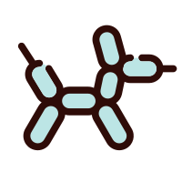
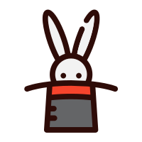

# 概述
此处用于存放一些 {==帮助文档==} 。

## 专家 机器人 猴子
我认为我的读者可以分为 3 类人：懂行的；生搬硬套的；不仔细看，喜欢乱点的。可以称呼他们为——“专家”、“机器人”、“猴子”，我需要在编写文档时，找到平衡三者比重的落笔点。

> 为了避免词汇的褒贬性挑拨读者神经，同时也是因为找不到对应的免费图标，我使用{++“魔术师”、“气球狗”、“兔子”++}，做为{--“专家”、“机器人”、“猴子”--}的代称。

## 帮助文档
- <a href="操作系统/Windows/移动 C 盘 Users 文件夹/移动 C 盘 Users 文件夹.html">移动 C 盘 Users 文件夹</a>