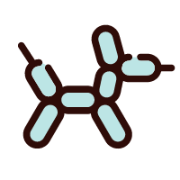
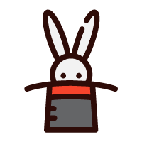

# 概述
此处用于存放一些帮助文档。

## 专家 机器人 猴子
我认为我的读者可以分为 3 类人：懂行的；生搬硬套的；不仔细看，喜欢乱点的。可以称呼他们为——“专家”、“机器人”、“猴子”，我需要在编写文档时，找到平衡三者比重的落笔点。

> 为了避免词汇的褒贬性挑拨读者神经，同时也是因为找不到对应的免费图标，我使用“魔术师”、“气球狗”、“兔子”，替代“专家”、“机器人”、“猴子”这一原先的代称。

