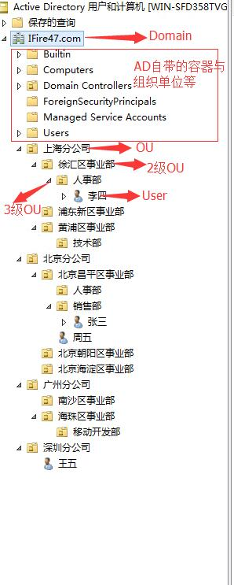

---
toc:
    depth_from: 2
---

# Active Directory
[TOC]

## 概述
&emsp;**Active Directory** 中文翻译为活动目录，是微软 Windows Server 中，负责架构中大型网路环境的集中式目录管理服务（Directory Services），Windows 2000 Server 开始内建于 Windows Server 产品中，它处理了在组织中的网路物件，物件可以是**计算机**，**用户**，**群组**，**组织单元（OU）** 等等，只要是在 Active Directory 结构定义档（schema）中定义的物件，就可以储存在 Active Directory 资料档中，并利用 Active Directory Service Interface 来存取。

## 作用
1. 用户服务
    - 管理用户的域账号
    - 用户信息
    - 企业通信录（与电子邮箱系统集成）
    - 用户组管理
    - 用户身份认证
    - 用户授权管理
    - 按需实施组管理策略
    > 这里不单单指某些线上的应用更多的是指真实的计算机，服务器等
2. 计算机管理
    - 管理服务器及客户端计算机账户
    - 所有服务器及客户端计算机加入域管理并按需实施组策略
3. 资源管理
    - 管理打印机
    - 文件共享服务
    - 网络资源等实施组策略
4. 应用系统的支持
    - 对于电子邮件（Exchange）
    - 在线及时通讯（Lync）
    - 企业信息管理（SharePoint）
    - 微软 CRM,ERP 等业务系统提供数据认证（身份认证、数据集成、组织规则等）
    > 这里不单是微软产品的集成，其它的业务系统根据公用接口的方式一样可以嵌入进来
5. 客户端桌面管理,系统管理员可以集中的配置各种桌面配置策略
    - 用户适用域中资源权限限制
    - 界面功能的限制
    - 应用程序执行特征的限制
    - 网络连接限制
    - 安全配置限制

## 域架构常用对象
1. ==域=={++Domain++} 是 AD <small><i>Active Directory</i></small> 的根，是 AD 的管理单位，可以简单理解为 {++A 公司总部++}，包含着大量的域对象：
    - ==组织单位=={++Organizational Unit++}
    - ==群组=={++Group++}
    - ==用户=={++User++}
    - ==计算机=={++Computer++}
    - ==联系人=={++Contact++}
    - 打印机，安全策略等

2. ==组织单位=={++Organizational Unit++} 简称 OU 是一个容器对象，可以把域中的对象组织成逻辑组，帮助网络管理员简化管理组，可以简单理解为 {++A 公司的分公司++}，可以包含下列类型的对象：
    - 用户
    - 计算机
    - 工作组
    - 打印机
    - 安全策略
    - 其他组织单位等。
    > 可以在组织单位基础上部署组策略，统一管理组织单位中的域对象

3. ==群组=={++Group++} 是一批具有相同管理任务的用户账户，计算机账户或者其他域对象的一个集合，可以简单理解为{++某分公司里的某事业部++}，例如公司的开发组，产品组，运维组等等。群组类型分为两类:
    - 安全组：用来设置有安全权限相关任务的用户或者计算机账户的集合。比如：Tiger 组都可以登录并访问某 ftp 地址，并拿到某个文件。
    - 通信组：用于用户之间通信的组，适用通信组可以向一组用户发送电子邮件。比如：我要向团队内 10 为成员都发送同一封邮件这里就要抄送 9 次，而使用组的话我直接可以发送给 @Tiger ，所有 Tiger 组内的成员都会收到邮件。

4. ==用户=={++User++}可以简单理解为：某个工作人员，是 AD 域中最小的管理单位，域用户最容易管理又最难管理，如果赋予域用户的权限过大，将带来安全隐患，如果权限过小域用户无法正常工作。域中常见用户类型分为：
    - 普通域用户:创建的域用户默认就添加到 "Domain Users" 中。
    - 域管理员:普通域用户添加进 "Domain Admins" 中，其权限升为域管理员。
    - 企业管理员:普通域管理员添加进 "Enterprise Admins" 后，其权限提升为企业管理员，企业管理员具有最高权限。
> 以上 4 个 AD 对象是我们入门必须尽快消化理解的概念。而 AD 中的对象概念还有很多，包括 DNS，域林，域树，根域等等。以及有关计算机的概念如：独立服务器，成员服务器，域控服务器，客户端计算机等。一个大致的 AD 如下图所示。

[--> Active Directory 的基本概念](https://www.cnblogs.com/IFire47/p/6672176.html)