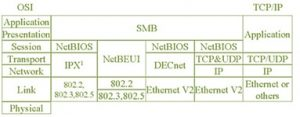
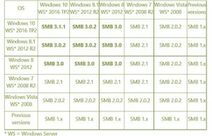

---
toc:
    depth_from: 2
---
@import "style.css"

# CIFS <small><small>*Common Internet File System*</small></small>

[TOC]

## 功能
&emsp;支持通过网络共享文件和打印机

> CIFS 是开放的标准而且已经被作为 Internet 应用程序标准被提交到 IETF

## 发展历史
&emsp;在 PC 早期 IBM 和 Sytec 共同开发了 **NetBIOS** ，用于为一个小型 LAN 的简单网络系统，提供程序与网络硬件之间的接口。它包括一个寻址方案 —— 该寻址方案使用 16 字节名称来标识工作站和启用网络的应用程序。
&emsp;其后 Microsoft 向 DOS 添加了功能，这些功能允许重定向磁盘 I/O 到 NetBIOS 接口，从而可以通过 LAN 共享磁盘空间。他们最终使用的文件共享协议被称为 **SMB** {++主要在局域网中使用++}，现在被称为 **CIFS** {++是 SMB 协议扩展到 Internet 后，实现的 Internet 文件共享++}。
> &emsp;自 Windows 2000， Microsoft 尝试取消 CIFS 和 NetBIOS 的耦合，使 SMB 协议也可以承载于 TCP/IP 之上，名称查询转而通过 **DNS** 进行；构建的 **Active Directory** 则成为了 Windows 2000 网络的核心，旧式的 “NetBIOS 服务”向 Active Directory 注册其名称；采用分层的 NT 域系统，代替隔离的域控制器。

## 核心协议 SMB
—— CIFS 的核心是 SMB <small><i>Server Message Block</i></small> 协议的最新版本

{>><<}

|OSI|·||||TCP/IP|
|:--:|:--:|:--:|:--:|:--:|:--:|
|Application|SMB||||Application|
|Presentation|^||||^|
|Session|NetBIOS|NetBEUI|NetBIOS|NetBIOS|^|
|Transport|IPX/SPX|^|DECnet|TCP&UDP|TCP/UDP|
|Network|^|^|^|IP|IP|
|Link|802.2,802.3,802.5|802.2,802.3,802.5|Ethernet V2|Ethernet V2|Ethernet or others|
|Physical|~|

SMB 协议可以用在因特网的 TCP/IP 协议之上，也可以用在其它网络协议如 IPX 和 NetBEUI 之上

## 实现
### Windows
&emsp;随着 Windows 的发展，Microsoft 在 SMB 程序包中增加了两个附加部分：
- 服务公告，称为 "browsing"
- 中央身份验证和授权服务，称为 "Windows NT 域控制"

> **browsing** 不是我们知道和喜欢的 Web 浏览，而是网络上计算机提供的可浏览服务列表（文件和打印共享），当您单击 Windows 的“网上邻居”图标时，就会显示此列表

### Samba
&emsp;Samba 是开源的 CIFS 实现，主要包含以下程序：
- smbd
    - 文件与打印机共享服务
    - 认证与授权
- samba
- nmbd
    - 名称解析服务 NBNS <small><i>NetBIOS Name Service</i></small>
    - 服务公告（browsing）
- swat
    - 通过 web 浏览器配置 Samba

> **NBNS** 在 LAN 上选举本地主浏览器（LMB），来保留可用服务的列表。除 LMB 外，还有域主浏览器（DMB）。DMB 甚至可以在路由网络上跨 NT 域协调浏览列表。使用 NBNS ，LMB 将找到其 DMB 以交换和合并浏览列表。因此，浏览列表将传播到 NT 域中的所有主机。不幸的是，同步时间分散了一些。远程子网中的更改可能需要一个多小时才能显示在网上邻居中。

### 版本与兼容性

|Windows 版本|SMB 版本|Samba 版本|
|--|:--:|--|
|Windows 10 , Windows Server 2016 TP2|SMB 3.1.1|N/A|
|Windows 8.1 , Windows Server 2012 R2|SMB 3.0.2|^|
|Windows 8 , Windows Server 2012|SMB 3.0|samba 4.0.0 之后|
|Windows 7 , Windows Server 2008 R2|SMB 2.1|samba 4.0.0|
|Windows Vista , Windows Server 2008|SMB 2.0.2|samba 3.6|
|Previous Windows|SMB 1.x|samba 3.6 之前|

> 从版本 4.0 开始，Samba 能够作为 AD （<ruby>活动目录<rp>（</rp><rt>Active Directory</rt><rp>）</rp></ruby>） DC （<ruby>域控制器<rp>（</rp><rt>Domain Controller</rt><rp>）</rp></ruby>）运行
> - [从源代码构建 Samba](https://wiki.samba.org/index.php/Build_Samba_from_Source)

## 服务端口
|服务端口|协议|功能|
|--|--|--|
|53/tcp||
|53/udp||
|88/tcp|
|88/udp|
|135/tcp|RPC|RPC 端点映射程序（RPCSS）; Active Directory 复制远程过程调用|
|137/udp|NetBIOS|名称解析服务 nmbd|
|138/udp|NetBIOS|数据报服务|
|139/tcp|SMB|文件和打印共享 smbd|
|389/tcp|LDAP|用于 Active Directory Mode|
|389/udp|
|445/tcp|NetBIOS（在 windos 2000 及以后版本使用此端口）|CIFS 实现 Internet 文件共享|
|464/tcp|
|464/udp|
|636/tcp|
|1025-5000/tcp|RPC|Windows Server 2003 域中，默认的动态端口范围|
|49152-65535/tcp|RPC|Windows Server 2008 域中，默认的动态端口范围|
|901/tcp|~|用于网页管理 Samba|