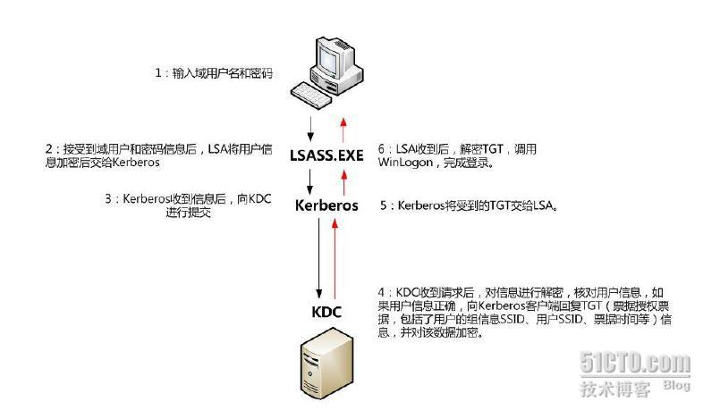

# 域用户登录过程
|域控制器版本|使用的协议|
|--|--|
|Windows NT 4.0|NTLM|
|Windows 2000，Windows 2003|Kerberos V5|
## NTLM
&emsp;**NTLM** 验证协议，其验证过程和前面的“登录到本机的过程”差不多，区别就在于验证账号的工作不是在本地 SAM 数据库中进行，而是在域控制器中进行。

## Kerberos V5
&emsp;**Kerberos V5** 协议更为安全可靠，通过这种协议登录到域，要向域控制器证明自己的域账号有效，用户需先申请允许请求该域的 TGS <small><i>Ticket-Granting Service</I></small> {++票据授予服务++}。获准之后，用户就会为所要登录的计算机申请一个会话票据，最后还需申请允许进入那台计算机的本地系统服务。
