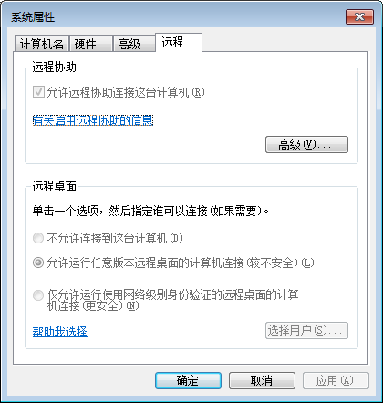
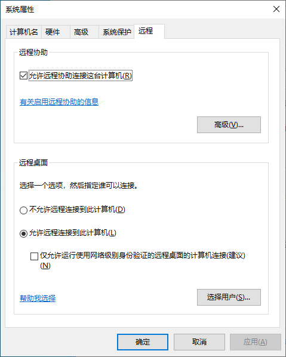
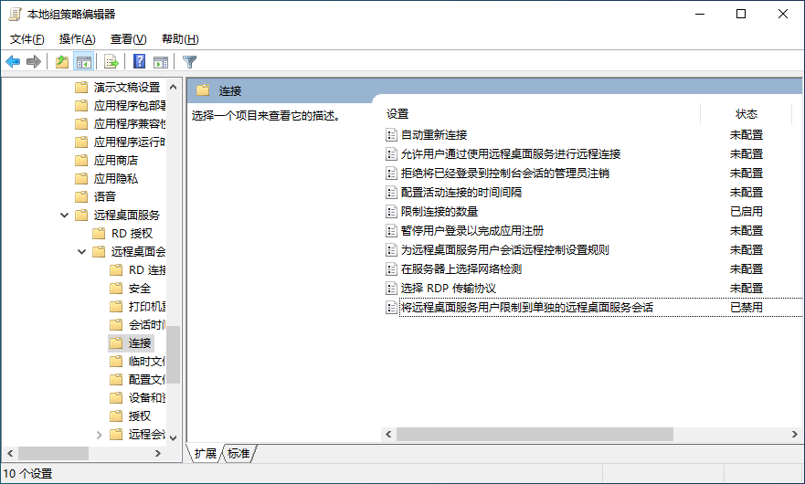
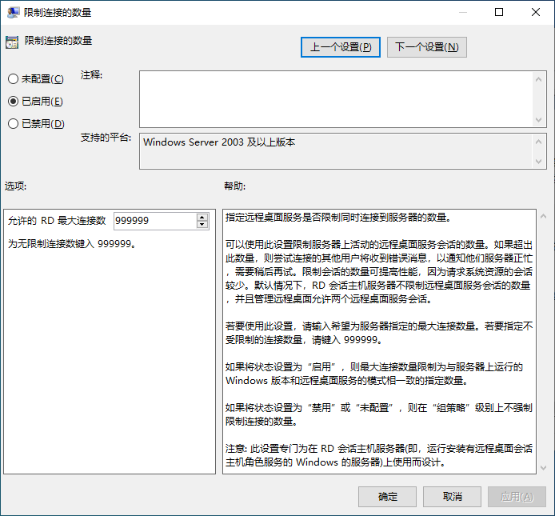
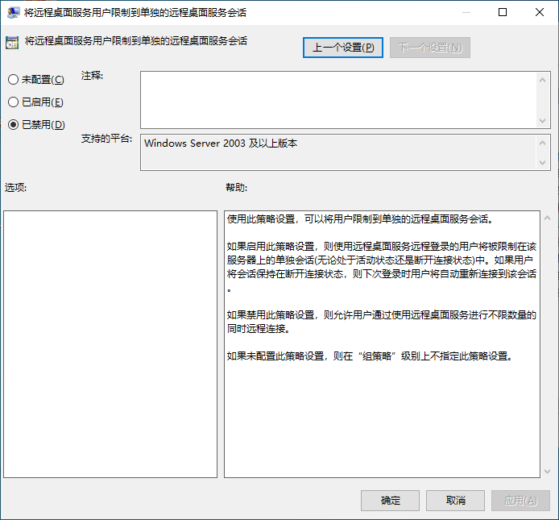
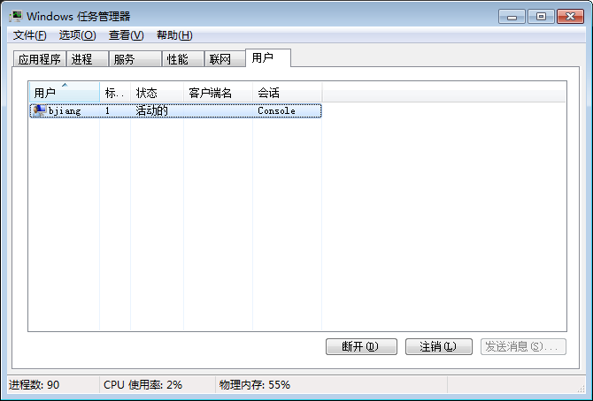

# 开启 mstsc 多用户
[TOC]
## mstsc 服务端设置

- 控制面板》 所有控制面板项》 系统》 远程设置》
    - **Win7 请看这里**
        - 在弹出的窗口中选择“远程”标签页
            - [X] “允许远程协助连接这台电脑（R）”
            - [X] “允许运行任意版本远程桌面的计算机连接（较不安全）（L）”
            - 点击 <button>选择用户（S）...</button> 按钮
                - 在弹出的窗口中添加非管理员用户（管理员账户默认被允许远程登录）
    
    - **Win10 Win8 请看这里**
        - 在弹出的窗口中选择“远程”标签页
            - [X] “允许远程协助连接这台电脑（R）”
            - [X] 选择 “允许远程连接到此计算机（L）”
            - 点击 <button>选择用户（S）...</button> 按钮
                - 在弹出的窗口中添加非管理员用户（管理员账户默认允许远程登录）
    
- 本地组策略编辑器》 计算机配置》 管理模板》 Windows组件》 远程桌面服务》 远程桌面会话主机》 连接
    
    - 限制连接的数量 **999999** “已启用”
        
    - 将远程桌面服务用户限制到单独的远程桌面服务会话 “已禁用”
        

# 解除 mstsc 远程用户数量限制
## 方法一
&emsp;&emsp;默认的， windows 在同一时间，只允许登录一个账户。请下载 [Universal Termsrv.dll Patch](https://universal-termsrv-dll-patch.fileplanet.com/) 以管理员身份运行，这将变更 `C:\Windows\System32\termsrv.dll` 系统文件来解除限制（使用前请先备份  ）

> 国内可用下载地址 [Universal Termsrv Patch(远程控制工具) 64位 V1.0.0.5 官方版](http://www.downxia.com/downinfo/155066.html)

&emsp;&emsp;*适用平台： Win2003 , WinXP , Vista , Win7 , Win8*

## 方法二
&emsp;&emsp;使用[任何 HEX 编辑器](http://texteditors.org/cgi-bin/wiki.pl?Tiny_Hexer)修改 `C:\Windows\System32\termsrv.dll` 以恢复并发远程桌面连接（修改前请先备份）
 - 命令行命令 `dxdiag` 查看 win10 版本，以确定更改位置
   - 10.0.17763.771 版本
       - 搜索 39 81 3C 06 00 00 0F 84 CB 2B 01 00
       - 替换成 B8 00 01 00 00 89 81 38 06 00 00 90
   - [win10 其他版本 ...](https://www.mysysadmintips.com/windows/clients/545-multiple-rdp-remote-desktop-sessions-in-windows-10)

&emsp;&emsp;*适用平台： Win10*

> **需要注意的：**
>
> Windows 更新会覆盖系统文件 `termsrv.dll` 的修改，可以关闭 Windows 自动更新

## 方法三
1. 请下载 [RDPWrap](https://github.com/stascorp/rdpwrap/releases) ，依次以管理员身份执行以下程序，并保证电脑网络畅通
    - `install.bat`
    - `update.bat`
    - `RDPConf.exe` 
    - 这将安装以下程序，被系统服务 `Remote Desktop Services` 使用以支持并发的用户连接
        - `C:\Program Files\RDP Wrapper\rdpwrap.dll`
        - `C:\Program Files\RDP Wrapper\rdpwrap.ini`
2. 执行 `RDPCheck.exe` 测试并发可用性
> 安装过程可能提示 : *无法从 github 下载最新的 rdpwrap.ini 配置文件*
> - 如 `RDPConf.exe` 提示不支持此系统版本，请手动[搜索](https://github.com/stascorp/rdpwrap/blob/master/res/rdpwrap.ini)替换 ( 官方配置文件最后更新于 2018/10/10 支持至 10.0.17763.1 版本 )
> - 非官方的对 [10.0.17134.706 版本至 10.0.18362.267 版本](https://github.com/stascorp/rdpwrap/issues/795) 的配置支持

&emsp;&emsp;*适用平台： 通用*

# 检查效果
- 服务端
    - 任务管理器
        - 点击 “用户” 标签页
            - 如果本机被远程登录，可以看到多个 “活动的” 用户
                
- 客户端
    - <kbd>Win</kbd> + <kbd>R</kbd> 输入 `mstsc` 回车
        - 输入远程主机上允许远程登录的账户（[管理员账户默认被允许远程登录](#admin)）