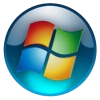

### 重命名文件夹 "C:\Users" 与 "C:\New"
1. 点击  按钮，点击 <button>注销</button>
1. 在登录界面点击 ，这将打开 `C:\Windows\System32\cmd.exe`

    
3. 依次输入以下命令，依次点击 <kbd>Enter</kbd>
    ```bat{class="line-numbers"}
    taskkill /f /t /im lsass.exe
    move C:\Users C:\Users2 && move C:\New C:\Users
    ```